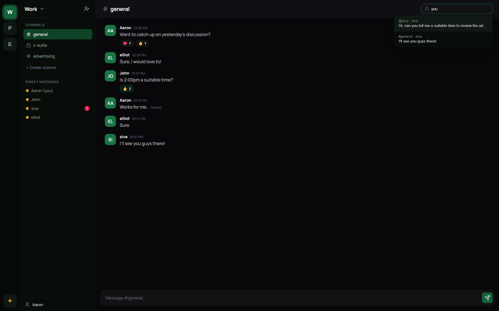
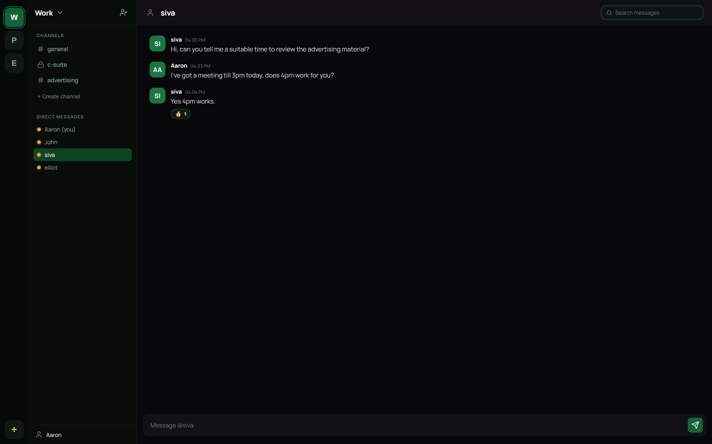

# Huddle

Huddle is a real-time team messaging platform where users can create workspaces, organize conversations into channels, and communicate instantly through WebSockets. It supports direct messages, message reactions, typing indicators, online presence tracking, and full-text message search.

Built as a full-stack JavaScript application with React on the frontend and Node.js/Express on the backend, backed by PostgreSQL.

## Screenshots

**Channel view** - messages, reactions, search, and online presence



**Direct messages** - one-on-one conversations between workspace members



## Features

- **Authentication** - JWT-based signup and signin with password hashing (bcrypt). Tokens are verified on both REST and WebSocket layers.
- **Workspaces** - Create, join, rename, and delete workspaces. Each workspace gets a shareable ID for inviting others. Ownership controls who can rename or delete.
- **Channels** - Public channels visible to all workspace members, and private channels with managed membership. A default `general` channel is created with every workspace.
- **Direct Messages** - One-on-one conversations between workspace members, reusing the channel infrastructure internally.
- **Real-time Messaging** - Messages are sent and received over Socket.IO. Supports editing, soft deletion, and emoji reactions, all broadcast instantly to connected users.
- **Typing Indicators** - See who is currently typing in a channel, updated in real time.
- **Online Presence** - Tracks which users are online per workspace, with multi-tab awareness (a user stays online until all tabs disconnect).
- **Unread Counts** - Per-channel unread message counts based on a last-read timestamp, updated when a channel is viewed.
- **Message Search** - Full-text search across all accessible channels and DMs within a workspace.
- **Infinite Scroll** - Older messages are loaded on demand with cursor-based pagination.
- **Rate Limiting** - Both REST API endpoints and WebSocket events are rate-limited to prevent abuse.
- **Input Validation** - All user inputs (usernames, passwords, messages, channel names) are validated server-side with defined length constraints.

## Tech Stack

| Layer    | Technology                       |
| -------- | -------------------------------- |
| Frontend | React 19, Vite, Socket.IO Client |
| Backend  | Node.js, Express 5, Socket.IO    |
| Database | PostgreSQL (Neon)                |
| Auth     | JSON Web Tokens, bcryptjs        |
| Icons    | Lucide React                     |

## Database Schema

The application uses the following tables:

- `users` - stores account credentials and profile info
- `workspaces` - each workspace has an owner and a unique ID
- `workspace_members` - many-to-many relationship between users and workspaces
- `channels` - belongs to a workspace; flags for `is_dm` and `is_private`
- `channel_members` - tracks membership for private channels and DMs
- `messages` - stores message content with soft delete and edit tracking
- `message_reactions` - emoji reactions on messages, unique per user per emoji
- `channel_read_status` - last-read timestamp per user per channel for unread counts

Schema migrations run idempotently at server startup.

## API Overview

All endpoints are prefixed with `/api` and require a valid JWT in the `Authorization` header (except signup and signin).

**Auth**

- `POST /api/users/signup` - create a new account
- `POST /api/users/signin` - log in and receive a JWT

**Workspaces**

- `GET /api/workspaces` - list workspaces the user belongs to
- `POST /api/workspaces` - create a new workspace
- `POST /api/workspaces/join` - join an existing workspace by ID
- `GET /api/workspaces/:id` - get full workspace data (channels, members, messages, unread counts)
- `PUT /api/workspaces/:id` - rename a workspace (owner only)
- `DELETE /api/workspaces/:id` - delete a workspace (owner only)
- `GET /api/workspaces/:id/search?q=` - search messages across the workspace
- `POST /api/workspaces/:id/dm` - open or create a DM channel with another member

**Channels**

- `POST /api/workspaces/:id/channels` - create a channel (public or private)
- `GET /api/workspaces/:id/channels/:channelId/messages` - paginated message history
- `POST /api/workspaces/:id/channels/:channelId/read` - mark a channel as read
- `GET /api/workspaces/:id/channels/:channelId/members` - list private channel members
- `PUT /api/workspaces/:id/channels/:channelId/members` - update private channel membership

**WebSocket Events**

- `joinWorkspace`, `sendMessage`, `editMessage`, `deleteMessage`, `toggleReaction`, `startTyping`, `stopTyping`

## Project Structure

```
huddle/
  backend/
    src/
      config/         # database connection, schema initialization
      controllers/    # business logic for users, workspaces, channels, DMs, messages
      middleware/     # JWT auth, REST rate limiter, socket rate limiter
      routes/         # Express route definitions
      utils/          # input validation helpers
      index.js        # server entry point, Socket.IO event handlers, presence tracking
  frontend/
    src/
      api.js          # axios instance with auth interceptor
      App.jsx         # main application component, state management, socket wiring
      components/
        auth/         # sign in, sign up pages
        chat/         # message list, message input, typing indicator, search bar
        layout/       # workspace sidebar, channel sidebar
        ui/           # popups, modals, toasts, icons
```

## Getting Started

### Prerequisites

- Node.js (v18 or higher)
- A PostgreSQL database (local or hosted, e.g. Neon)

### Setup

1. Clone the repository

```
git clone https://github.com/josephsyrus/huddle.git
cd huddle
```

2. Set up the backend

```
cd backend
npm install
```

Create a `.env` file in the `backend/` directory:

```
DATABASE_URL=your_postgresql_connection_string
JWT_SECRET=your_jwt_secret
FRONTEND_URL=http://localhost:5173
PORT=3001
```

Start the server:

```
npm start
```

The database tables are created automatically on first run.

3. Set up the frontend

```
cd frontend
npm install
npm run dev
```

The app will be available at `http://localhost:5173`.

## License

MIT
